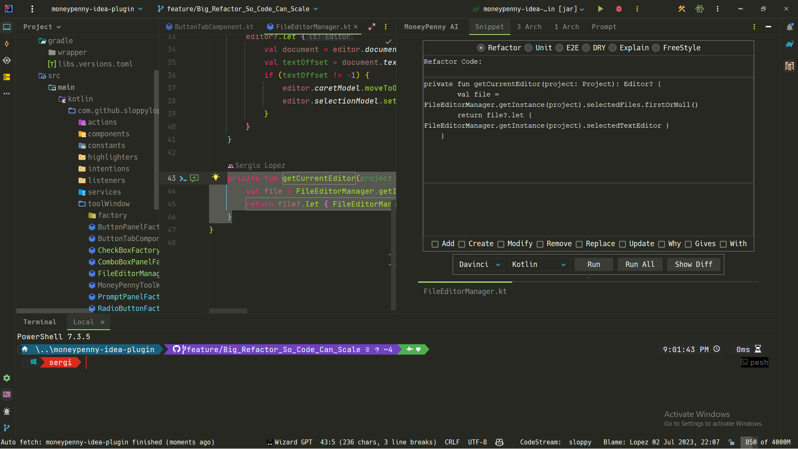

<!DOCTYPE html>
<html lang="html">
<head>
</head>
<body>

  

    
    <h1>&nbsp;&nbsp;MoneyPenny AI Prompt</h1>
  

    

      Welcome to MoneyPenny AI Prompt, the powerful Kotlin IntelliJ IDEA plugin that revolutionizes
      code refactoring! With MoneyPenny AI Prompt, you can easily improve, refactor, and test your
      codebase with just a few clicks. Seamlessly integrated with IntelliJ IDEA, this plugin provides
      a user-friendly interface to simplify your development workflow.
    

<h3>Refactor Your Codebase with Ease at Full Speed!</h3>

  

  
  
  

<h2>Template ToDo list</h2>

  <ul>
    <li>[x] Create a new <a href="[template]">IntelliJ Platform Plugin Template</a> project.</li>
    <li>[ ] Get familiar with the <a href="[template]">template documentation</a>.</li>
    <li>[ ] Adjust the <a href="./gradle.properties">pluginGroup</a>, <a href="./src/main/resources/META-INF/plugin.xml">plugin ID</a>, and <a href="./src/main/kotlin">sources package</a>.</li>
    <li>[ ] Adjust the plugin description in <code>README</code> (see <a href="[docs:plugin-description]">Tips</a>).</li>
    <li>[ ] Review the <a href="https://plugins.jetbrains.com/docs/marketplace/legal-agreements.html?from=IJPluginTemplate">Legal Agreements</a>.</li>
    <li>[ ] <a href="https://plugins.jetbrains.com/docs/intellij/publishing-plugin.html?from=IJPluginTemplate">Publish a plugin manually</a> for the first time.</li>
    <li>[ ] Set the <code>PLUGIN_ID</code> in the above README badges.</li>
    <li>[ ] Set the <a href="https://plugins.jetbrains.com/docs/intellij/plugin-signing.html?from=IJPluginTemplate">Plugin Signing</a> related <a href="https://github.com/JetBrains/intellij-platform-plugin-template#environment-variables">secrets</a>.</li>
    <li>[ ] Set the <a href="https://plugins.jetbrains.com/docs/marketplace/plugin-upload.html?from=IJPluginTemplate">Deployment Token</a>.</li>
    <li>[ ] Click the <kbd>Watch</kbd> button on the top of the <a href="[template]">IntelliJ Platform Plugin Template</a> to be notified about releases containing new features and fixes.</li>
  </ul>

  

    This Fancy IntelliJ Platform Plugin is going to be your implementation of the brilliant ideas that you have.
     
    This specific section is a source for the <a href="/src/main/resources/META-INF/plugin.xml">plugin.xml</a> file which will be
    extracted by the <a href="/build.gradle.kts">Gradle</a> during the build process.
     
    To keep everything working, do not remove <code>&lt;!-- ... --&gt;</code> sections.
  

  <h1>MoneyPenny AI Prompt - Refactor Your Codebase with Ease</h1>

  

    MoneyPenny AI Prompt is a powerful IntelliJ IDEA plugin designed to supercharge your code refactoring process. With this plugin, you can easily refactor any codebase by simply dragging and dropping files into the tool window text area prompt. MoneyPenny AI Prompt leverages the capabilities of ChatGPT to parallelize all requests, ensuring fast and efficient code transformations.
  

<h2>Features</h2>

  <ul>
    <li>Drag and drop files to the tool window text area prompt for quick and easy refactoring.</li>
    <li>Parallelize all requests to ChatGPT for optimal performance and speed.</li>
    <li>Seamlessly integrate with IntelliJ IDEA for a smooth and intuitive user experience.</li>
    <li>Choose files and select the desired operation to apply, such as correcting syntax errors, improving code style, adding unit tests, or performing end-to-end testing.</li>
    <li>Click "Run" to initiate the code refactoring process.</li>
    <li>Utilize IntelliJ IDEA's file comparison feature to check the differences and verify the changes made by MoneyPenny AI Prompt.</li>
  </ul>

<h2>Installation</h2>

  
To install MoneyPenny AI Prompt, follow these simple steps:

  <ul>
    <li>Using IDE built-in plugin system:</li>
    <ol>
      <li>Go to <strong>Settings/Preferences</strong> &gt; <strong>Plugins</strong> &gt; <strong>Marketplace</strong>.</li>
      <li>Search for "MoneyPenny AI Prompt".</li>
      <li>Click <strong>Install Plugin</strong>.</li>
    </ol>
    <li>Manual installation:</li>
    <ol>
      <li>Download the <a href="https://github.com/sloppylopez/moneypenny-idea-plugin/releases/latest">latest release</a> of MoneyPenny AI Prompt.</li>
      <li>In IntelliJ IDEA, go to <strong>Settings/Preferences</strong> &gt; <strong>Plugins</strong> &gt; ⚙️ &gt; <strong>Install plugin from disk...</strong>.</li>
      <li>Select the downloaded JAR file of MoneyPenny AI Prompt and click <strong>OK</strong>.</li>
    </ol>
  </ul>

  

  
Plugin based on the <a href="[template]">IntelliJ Platform Plugin Template</a>.

<h2>Debugging the Plugin</h2>

  

    If your IntelliJ IDEA plugin doesn't have a main class or an entry point that you can directly run and debug, you can still debug it by attaching the debugger to the running IntelliJ IDEA instance. Here's how you can do it:
  

  <ol>
    <li>Build and package your plugin into a JAR or an IntelliJ IDEA plugin format (such as a ZIP or JAR with specific plugin structure).</li>
    <li>Install or enable your plugin in IntelliJ IDEA. You can do this by going to "File" -&gt; "Settings" -&gt; "Plugins" and selecting "Install Plugin from Disk" or "Enable" if your plugin is already installed.</li>
    <li>Run the IntelliJ IDEA instance that has your plugin enabled.</li>
    <li>In your IntelliJ IDEA instance, go to "Run" -&gt; "Attach to Process" to open the "Attach to Process" dialog.</li>
    <li>In the "Attach to Process" dialog, select the IntelliJ IDEA process that you want to attach the debugger to. Make sure you choose the correct process if multiple instances are running.</li>
    <li>Click the "OK" button to attach the debugger to the selected process.</li>
    <li>IntelliJ IDEA will connect the debugger to the running instance, and you can now set breakpoints in your plugin code.</li>
    <li>Trigger the functionality of your plugin within the running IntelliJ IDEA instance to hit the breakpoints and start debugging.</li>
    <li>Use the debugging features provided by IntelliJ IDEA, such as stepping through the code, inspecting variables, and evaluating expressions, to analyze and debug your plugin.</li>
    <li>By attaching the debugger to the running IntelliJ IDEA process, you can debug your plugin code even if it doesn't have a specific main class or entry point.</li>
  </ol>

<h2>Useful Links</h2>

  
Here are some useful links to help you make the most of MoneyPenny AI Prompt and IntelliJ IDEA:

  <ul>
    <li><a href="https://plugins.jetbrains.com/docs/intellij/syntax-highlighter-and-color-settings-page.html#define-a-color-settings-page">Syntax Highlighter and Color Settings Page</a></li>
    <li><a href="https://plugins.jetbrains.com/docs/intellij/lexer-and-parser-definition.html#define-a-parser">Lexer and Parser Definition</a></li>
    <li><a href="https://plugins.jetbrains.com/docs/intellij/controlling-highlighting.html">Controlling Highlighting</a></li>
    <li><a href="https://web.mit.edu/6.005/www/sp14/psets/ps4/java-6-tutorial/components.html">Java Swing Components</a></li>
    <li><a href="https://docs.oracle.com/javase/tutorial/uiswing/components/tabbedpane.html">Java Swing Tabbed Pane</a></li>
    <li><a href="https://docs.oracle.com/javase/tutorial/uiswing/examples/components/index.html#TabbedPaneDemo">Java Swing Examples</a></li>
    <li><a href="https://medium.com/agorapulse-stories/how-to-debug-your-own-intellij-idea-instance-7d7df185a48d">Debugging Your IntelliJ IDEA Instance</a></li>
    <li><a href="https://docs.oracle.com/javase/8/javafx/layout-tutorial/index.html">JavaFX Layout Tutorial</a></li>
    <li><a href="https://openjfx.io/javadoc/14/javafx.controls/javafx/scene/control/TabPane.html">JavaFX Tab Pane</a></li>
  </ul>

<h2>Contributing</h2>

  

    Contributions are welcome! If you have any ideas, suggestions, or bug reports, please create an issue on the
    <a href="https://github.com/sloppylopez/moneypenny-idea-plugin">MoneyPenny AI Prompt GitHub repository</a>.
    If you would like to contribute code, please fork the repository and submit a pull request.
  

<h2>License</h2>

  

    This plugin is licensed under the Apache License 2.0. See the <a href="LICENSE">LICENSE</a> file for more details.
  

</body>
</html>
