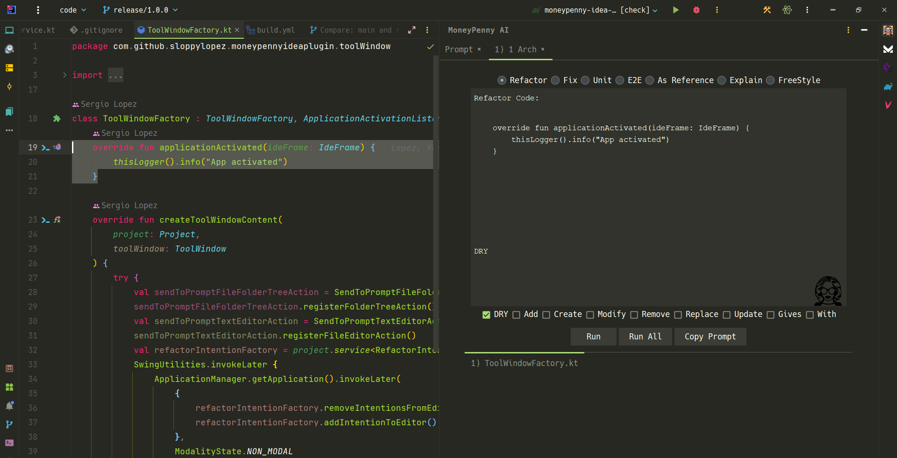

<!DOCTYPE html>
<html lang="html">
<body>

  

    
    <h1>&nbsp;&nbsp;MoneyPenny AI Prompt</h1>
  

    

        MoneyPenny AI Prompt, the cutting-edge IntelliJ IDEA plugin that revolutionizes code refactoring! Empower yourself to enhance, refactor, and test your codebase effortlessly with just a few clicks. Experience the seamless integration with IntelliJ IDEA, making code optimization a breeze!
    

<h2>Welcome to Prompt Driven Development!</h2>

  
  
  
  <a href="https://plugins.jetbrains.com/plugin/22252-moneypenny-ai"></a

<h2>Unrivaled Features</h2>

<ul>
  <li>Multi-File Refactoring: Refactor, add, or modify multiple files simultaneously.</li>
  <li>Lightning-Fast Responses: Enjoy seamless coding flow without delays.</li>
  <li>16000 Token Contextual Prompt: Smarter, contextually relevant coding suggestions.</li>
  <li>Optimal Performance & Speed: No Typewriter effect and parallelized requests for lightning-fast results.</li>
  <li>Seamless Integration: Effortlessly integrates into IntelliJ IDEA.</li>
  <li>Wide Range of Operations: Choose files and apply various operations.</li>
</ul>

Download MoneyPenny AI Prompt now and become a 10x developer with AI-powered coding efficiency.

Experience unparalleled advantages today, leaving competitors behind. Unlock the true power of AI in your coding workflow and create brilliance effortlessly. Elevate your coding prowess with intelligent completions and achieve more in less time. Get started on your transformative coding journey with MoneyPenny AI Prompt - the ultimate IntelliJ IDEA plugin for 10x developers.

<h2>History of the Project</h2>

The inception of MoneyPenny AI Prompt is a testament to the remarkable capabilities of ChatGPT. Created in a short span of just one month, this revolutionary project was developed without any prior experience in Kotlin or IntelliJ IDEA SDK.

The driving force behind this remarkable achievement was the invaluable assistance provided by ChatGPT. With ChatGPT's unparalleled language understanding and coding capabilities, it became the author of a staggering 98% of the code that powers this plugin.

ChatGPT's collaboration and intelligence played a pivotal role in crafting a tool that has now become the ultimate companion for developers seeking to achieve 10x productivity. It not only enabled the implementation of complex functionalities but also facilitated seamless integration into IntelliJ IDEA.

Experience the tantamount outcome of this collaboration by downloading MoneyPenny AI Prompt and witness the incredible synergy of human imagination and AI intelligence.

<h2>Installation</h2>

To install MoneyPenny AI Prompt, you have two options:

<ul>
  <li>Option 1: Using IDE built-in plugin system (when the plugin is published):</li>
  <ol>
    <li>Go to <strong>Settings/Preferences</strong> &gt; <strong>Plugins</strong> &gt; <strong>Marketplace</strong>.</li>
    <li>Search for "MoneyPenny AI Prompt".</li>
    <li>Click <strong>Install Plugin</strong>.</li>
  </ol>
  <li>Option 2: Manual installation (until the plugin gets published):</li>
  <ol>
    <li>Fork the repository of the MoneyPenny AI Prompt plugin from GitHub.</li>
    <li>Clone the forked repository to your local machine.</li>
    <li>Build the plugin to create a JAR file.</li>
    <li>In IntelliJ IDEA, go to <strong>Settings/Preferences</strong> &gt; <strong>Plugins</strong> &gt; ⚙️ &gt; <strong>Install plugin from disk...</strong>.</li>
    <li>Select the generated JAR file of MoneyPenny AI Prompt and click <strong>OK</strong>.</li>
  </ol>
</ul>

<em>Note: Until the plugin gets published, you can fork the GitHub repository, create a JAR file locally, and manually install it using the second option above.</em>

<em>Observe that you need an environment variable in your machine called OPENAI_API_KEY, containing the key to your ChatGPT API Key; otherwise, the plugin won't function correctly.</em>

  

  
Plugin based on the <a href="https://github.com/sloppylopez/moneypenny-idea-plugin/workflows/Build/badge.svg">IntelliJ Platform Plugin Template</a>.

<h2>Useful Links</h2>

  
Here are some useful links to help you make the most of MoneyPenny AI Prompt and IntelliJ IDEA:

  <ul>
    <li><a href="https://plugins.jetbrains.com/docs/intellij/syntax-highlighter-and-color-settings-page.html#define-a-color-settings-page">Syntax Highlighter and Color Settings Page</a></li>
    <li><a href="https://plugins.jetbrains.com/docs/intellij/lexer-and-parser-definition.html#define-a-parser">Lexer and Parser Definition</a></li>
    <li><a href="https://plugins.jetbrains.com/docs/intellij/controlling-highlighting.html">Controlling Highlighting</a></li>
    <li><a href="https://web.mit.edu/6.005/www/sp14/psets/ps4/java-6-tutorial/components.html">Java Swing Components</a></li>
    <li><a href="https://docs.oracle.com/javase/tutorial/uiswing/components/tabbedpane.html">Java Swing Tabbed Pane</a></li>
    <li><a href="https://docs.oracle.com/javase/tutorial/uiswing/examples/components/index.html#TabbedPaneDemo">Java Swing Examples</a></li>
    <li><a href="https://medium.com/agorapulse-stories/how-to-debug-your-own-intellij-idea-instance-7d7df185a48d">Debugging Your IntelliJ IDEA Instance</a></li>
    <li><a href="https://docs.oracle.com/javase/8/javafx/layout-tutorial/index.html">JavaFX Layout Tutorial</a></li>
    <li><a href="https://openjfx.io/javadoc/14/javafx.controls/javafx/scene/control/TabPane.html">JavaFX Tab Pane</a></li>
    <li><a href="https://www.youtube.com/watch?v=WRE5VwsS1X4">Debug Intellij Idea Plugin</a></li>
    <li><a href="https://developerlife.com/2021/03/13/ij-idea-plugin-advanced/">Idea Plugin Advanced Tutorial</a></li>
    <li><a href="https://intellij-support.jetbrains.com/hc/en-us/community/posts/360002476840-How-to-auto-start-initialize-plugin-on-project-loaded-">Autostart</a></li>
    <li><a href="https://developerlife.com/2021/03/13/ij-idea-plugin-advanced/#psi-access-and-mutation">Psi Access and Mutation</a></li>
    <li><a href="https://plugins.jetbrains.com/docs/intellij/psi-files.html#how-do-i-get-a-psi-file">Psi files</a></li>
    <li><a href="https://plugins.jetbrains.com/docs/intellij/plugin-dependencies.html?from=jetbrains.org#bundled-and-other-plugins">Plugins Support</a></li>
    <li><a href="https://mediamodifier.com/svg-editor#">Svg Editor</a></li>
  </ul>

<h2>Contributing</h2>

  

    Contributions are welcome! If you have any ideas, suggestions, or bug reports, please create an issue on the
    <a href="https://github.com/sloppylopez/moneypenny-idea-plugin">MoneyPenny AI Prompt GitHub repository</a>.
    If you would like to contribute code, please fork the repository and submit a pull request.
  

<h2>Idea Plugin Description</h2>
<!-- Plugin description -->
Experience the future of Prompt Driven Development (PDD) coding with MoneyPenny AI Prompt, the ultimate IntelliJ IDEA plugin designed to elevate your coding experience to new heights. Standout features include:

* Multi-File Refactoring: Save valuable time and effort by refactoring, adding, or modifying multiple files simultaneously - a capability lacking in Copilot X.
* Faster Responses, No Typewriter Effect: Enjoy lightning-fast responses without the typewriter effect, ensuring a seamless coding flow. MoneyPenny AI Prompt prioritizes speed over web chat-based solutions.
* 16000 Token Contextual Prompt: Tap into the extensive context of the ChatGPT model for smarter, contextually relevant coding suggestions, surpassing standard web chatbots' limitations.
* Seamless Integration & Intelligence: Effortlessly integrate MoneyPenny AI Prompt into IntelliJ IDEA, enhancing your coding experience with intelligent code completions and predictive assistance.
* Continuous Evolution: Expect continuous improvement as MoneyPenny AI Prompt evolves with the latest advancements in AI and coding practices.

Download MoneyPenny AI Prompt now to unlock the power of AI in your coding workflow, surpassing other plugins and competitors. Elevate your coding efficiency and create brilliance with ease.
<!-- Plugin description end -->
</body>
</html>
