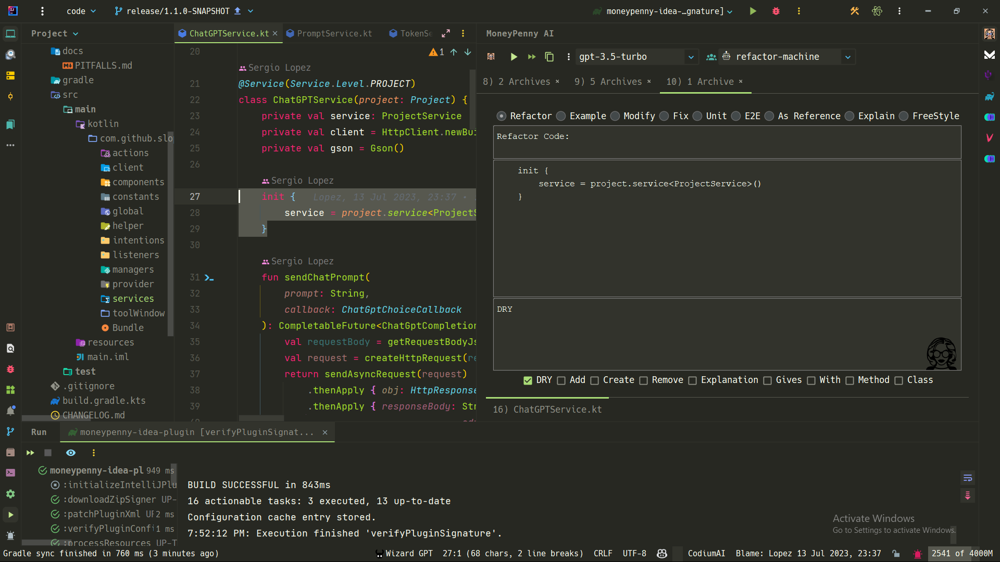

  

    
    <h1>MoneyPenny AI Prompt</h1>
  

    

        MoneyPenny AI Prompt, the cutting-edge IntelliJ IDEA plugin now compatible with ChatGPT-4! It revolutionizes code refactoring by allowing users to utilize a 16,000 or even 32,000 token contextual prompt. Empower yourself to enhance, refactor, and test your codebase effortlessly with just a few clicks. Experience the seamless integration with IntelliJ IDEA, making code optimization a breeze!
    

## Embark on a Prompt Driven Development Journey!

 

## Exceptional Performance with MoneyPenny AI Prompt

- **Multi-File Refactoring**: Revamp, supplement, or modify multiple files at once.
- **Up to 32,000 Token Contextual Prompt**: Get smart, context-aware coding suggestions using extended contextual
  prompt.
- **Optimized Performance & Speed**: No Typewriter effect, enjoy speed with parallelized requests.
- **Smooth Integration**: Use all features of IntelliJ IDEA effortlessly.
- **Buzzwords**: To avoid typing the most common buzzwords, "refactor", "fix", "add" and such.

Watch the *Code Frequency* graf below to see how MoneyPenny AI Prompt has helped achieve
10x productivity. This chart represents the code frequency over the last 1 year of development of the template
for Intellij which was used as a seed to create MoneyPenny AI Prompt. In just a month with no previous
experience of Kotlin or IntelliJ IDEA SDK.
Watch productivity skyrocket with MoneyPenny AI Prompt!

https://github.com/JetBrains/intellij-platform-plugin-template/graphs/code-frequency

VS

https://github.com/sloppylopez/moneypenny-ai-prompt/graphs/code-frequency

Stay ahead of your peers by experiencing the unmatched benefits of MoneyPenny AI Prompt today. Unleash the power of AI
into your coding workflow, create innovative solutions with ease, and achieve more in less time.

## The Origin Story

MoneyPenny AI Prompt is a testament to the extraordinary capabilities of ChatGPT. Developed in just a month, with no
prior knowledge of Kotlin or IntelliJ IDEA SDK.

ChatGPT, with its advanced language understanding and coding skills, is the primary author of this plugin, contributing
a staggering 98% of the code. It was pivotal in creating a tool that has become a developer's best friend, aiding in
achieving 10x productivity. It assisted in implementing complex functionalities and ensuring a smooth integration into
IntelliJ IDEA.

Witness the magic of this collaboration by installing MoneyPenny AI Prompt and experience the fantastic synergy of human
creativity and AI intelligence.

## How to Install

To install MoneyPenny AI Prompt, you have two straightforward options:

1. **IDE built-in plugin system** (Once the plugin is published)
    - Navigate to `Settings/Preferences > Plugins > Marketplace`.
    - Search for "MoneyPenny AI Prompt".
    - Click on `Install Plugin`.
2. **Manual installation** (Until the plugin is published)
    - Fork the GitHub repository of MoneyPenny AI Prompt.
    - Clone the forked repository on your machine.
    - Build the plugin to generate a JAR file.
    - In IntelliJ IDEA, navigate to `Settings/Preferences > Plugins > ⚙️ > Install plugin from disk...`.
    - Select the JAR file of MoneyPenny AI Prompt and click `OK`.

> You need your ChatGPT API Key named OPENAI_API_KEY for the plugin to work correctly.

Plugin based on
the [IntelliJ Platform Plugin Template](https://github.com/sloppylopez/moneypenny-idea-plugin/workflows/Build/badge.svg).

## Release 1.1.0 – Enhancements and Bug Fixes

We are pleased to announce the release of version 1.1.0, which introduces significant bug fixes and improves
the overall performance and stability of the plugin. This release solidifies our commitment to providing the best
possible experience for our users.

### Enhancements

* Fix most bugs that was making refactoring tedious, still possibly more to go
* Add comboBox to control engines, so we can test using the smaller engine
* Add comboBox to control roles, so we can have a more diverse set of prompts
* Change 90's buttons for proper toolBar inside toolWindow
* Add automagic DRY action in right click menu
* Add action with submenus in right click menu

## Useful Resources

To make the most of MoneyPenny AI Prompt and IntelliJ IDEA, check out these resources:

[List of resource links as in the original README]

## Contribute to the Future

Your contributions are highly appreciated! If you have innovative ideas, suggestions, or encounter any bugs, feel free
to raise an issue on
the [MoneyPenny AI Prompt GitHub repository](https://github.com/sloppylopez/moneypenny-idea-plugin). Want to contribute
code? Fork the repository and submit a pull request. We're excited to see your contributions!

<h2>Useful Links</h2>

  
Here are some useful links to help you make the most of MoneyPenny AI Prompt and IntelliJ IDEA:

  <ul>
    <li><a href="https://plugins.jetbrains.com/docs/intellij/syntax-highlighter-and-color-settings-page.html#define-a-color-settings-page">Syntax Highlighter and Color Settings Page</a></li>
    <li><a href="https://plugins.jetbrains.com/docs/intellij/lexer-and-parser-definition.html#define-a-parser">Lexer and Parser Definition</a></li>
    <li><a href="https://plugins.jetbrains.com/docs/intellij/controlling-highlighting.html">Controlling Highlighting</a></li>
    <li><a href="https://web.mit.edu/6.005/www/sp14/psets/ps4/java-6-tutorial/components.html">Java Swing Components</a></li>
    <li><a href="https://docs.oracle.com/javase/tutorial/uiswing/components/tabbedpane.html">Java Swing Tabbed Pane</a></li>
    <li><a href="https://docs.oracle.com/javase/tutorial/uiswing/examples/components/index.html#TabbedPaneDemo">Java Swing Examples</a></li>
    <li><a href="https://medium.com/agorapulse-stories/how-to-debug-your-own-intellij-idea-instance-7d7df185a48d">Debugging Your IntelliJ IDEA Instance</a></li>
    <li><a href="https://docs.oracle.com/javase/8/javafx/layout-tutorial/index.html">JavaFX Layout Tutorial</a></li>
    <li><a href="https://openjfx.io/javadoc/14/javafx.controls/javafx/scene/control/TabPane.html">JavaFX Tab Pane</a></li>
    <li><a href="https://www.youtube.com/watch?v=WRE5VwsS1X4">Debug Intellij Idea Plugin</a></li>
    <li><a href="https://developerlife.com/2021/03/13/ij-idea-plugin-advanced/">Idea Plugin Advanced Tutorial</a></li>
    <li><a href="https://intellij-support.jetbrains.com/hc/en-us/community/posts/360002476840-How-to-auto-start-initialize-plugin-on-project-loaded-">Autostart</a></li>
    <li><a href="https://developerlife.com/2021/03/13/ij-idea-plugin-advanced/#psi-access-and-mutation">Psi Access and Mutation</a></li>
    <li><a href="https://plugins.jetbrains.com/docs/intellij/psi-files.html#how-do-i-get-a-psi-file">Psi files</a></li>
    <li><a href="https://plugins.jetbrains.com/docs/intellij/plugin-dependencies.html?from=jetbrains.org#bundled-and-other-plugins">Plugins Support</a></li>
    <li><a href="https://mediamodifier.com/svg-editor#">Svg Editor</a></li>
  </ul>

## MoneyPenny AI Prompt Plugin Description

<!-- Plugin description -->
Unveil the future of Prompt Driven Development (PDD) with MoneyPenny AI Prompt, a top-notch IntelliJ IDEA plugin
designed to skyrocket your coding productivity. Here are the standout features that set us apart from the rest:

- **Multi-File Refactoring**: Tweak, add, or adjust multiple files all at once, unlike other platforms like Copilot X.
- **Rapid Responses without Typewriter Effect**: Revel in lightning-fast responses without any disruptive typing effect,
  making your coding experience smoother than ever. We prioritize speed over web chat-based solutions.
- **16,000 Token Contextual Prompt**: Leverage the vast context of the ChatGPT model for smart, context-aware coding
  suggestions, going beyond the limitations of standard web chatbots.
- **Effortless Integration & Enhanced Intelligence**: Integrate MoneyPenny AI Prompt into IntelliJ IDEA effortlessly,
  boosting your coding experience with intelligent code completions and predictive assistance.

Download MoneyPenny AI Prompt today to unlock the potential of AI in your coding workflow, leaving other plugins and
competitors far behind. Boost your coding efficiency and create wonders with ease.
<!-- Plugin description end -->
