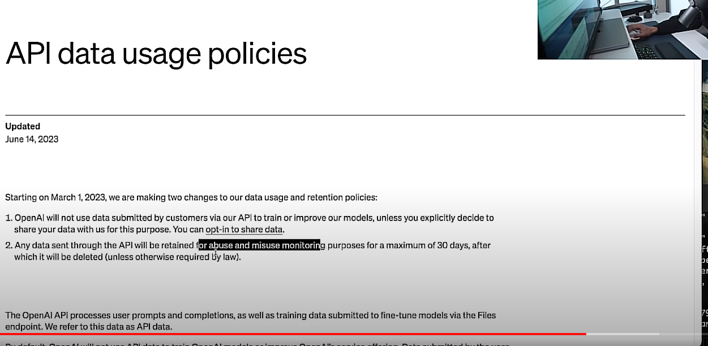

# Pitfalls

1) When we send code to ChatGPT the indentation will break if the code we send contains this chars ['\n', '\t', '\r'].
   To fix this we need to replace them with a space ' '.
2) https://intellij-support.jetbrains.com/hc/en-us/community/posts/360008653100-How-to-add-a-multi-button-in-table-s-toolbar-\
3) We can use this to ensure chat gpt will never answer with ```Kotlin ``` chars in the response https://platform.openai.com/docs/api-reference/chat/create
4) https://plugins.jetbrains.com/docs/intellij/basic-action-system.html#building-ui-from-actions
5) https://intellij-support.jetbrains.com/hc/en-us/community/posts/4408839632146-Signing-Plugin-always-throws-NullPointerException-pemObject-must-not-be-null

<section>
    <h2 class="notion-h notion-h1 notion-h-indent-0 notion-block-6859055bc61e48409065b74d478ba5c0"
        data-id="6859055bc61e48409065b74d478ba5c0"><span><div id="6859055bc61e48409065b74d478ba5c0"
                                                              class="notion-header-anchor"></div><span
            class="notion-h-title">What GPT models are available on OpenAI?</span></span></h2>
    <p class="notion-text notion-block-da7746a72fe64c68ba6ac7db54a50e26">There are 5 major base GPT models for working
        with text that are available from OpenAI through their API:</p>
    <table class="notion-simple-table notion-block-63ce75d53ce845239e8eb892c3a0e27c">
        <tbody>
        <tr class="notion-simple-table-row notion-block-36fd4eb57a7549038b0325b3d2e5017e">
            <td class="" style="width:139.6px">
                <div class="notion-simple-table-cell">Model name</div>
            </td>
            <td class="" style="width:139.6px">
                <div class="notion-simple-table-cell">Technical name</div>
            </td>
            <td class="" style="width:107.59375px">
                <div class="notion-simple-table-cell">Model family</div>
            </td>
            <td class="" style="width:193.59375px">
                <div class="notion-simple-table-cell">Price per 1000 tokens</div>
            </td>
            <td class="" style="width:120px">
                <div class="notion-simple-table-cell">Max tokens</div>
            </td>
            <td class="" style="width:119.59375px">
                <div class="notion-simple-table-cell">Available for fine-tuning</div>
            </td>
        </tr>
        <tr class="notion-simple-table-row notion-block-75e255461ec6410cb6024822e7171b60">
            <td class="" style="width:139.6px">
                <div class="notion-simple-table-cell">GPT-4 32k</div>
            </td>
            <td class="" style="width:139.6px">
                <div class="notion-simple-table-cell">gpt-4-32k</div>
            </td>
            <td class="" style="width:107.59375px">
                <div class="notion-simple-table-cell">GPT-4</div>
            </td>
            <td class="" style="width:193.59375px">
                <div class="notion-simple-table-cell">USD 0.0600 (prompt)
                    USD 0.1200 (completion)
                </div>
            </td>
            <td class="" style="width:120px">
                <div class="notion-simple-table-cell">32768</div>
            </td>
            <td class="" style="width:119.59375px">
                <div class="notion-simple-table-cell">No</div>
            </td>
        </tr>
        <tr class="notion-simple-table-row notion-block-6db46c9b2e1746feace3fbb4a55541e5">
            <td class="" style="width:139.6px">
                <div class="notion-simple-table-cell">GPT-4</div>
            </td>
            <td class="" style="width:139.6px">
                <div class="notion-simple-table-cell">gpt-4</div>
            </td>
            <td class="" style="width:107.59375px">
                <div class="notion-simple-table-cell">GPT-4</div>
            </td>
            <td class="" style="width:193.59375px">
                <div class="notion-simple-table-cell">USD 0.0300 (prompt)
                    USD 0.0600 (completion)
                </div>
            </td>
            <td class="" style="width:120px">
                <div class="notion-simple-table-cell">8192</div>
            </td>
            <td class="" style="width:119.59375px">
                <div class="notion-simple-table-cell">No</div>
            </td>
        </tr>
        <tr class="notion-simple-table-row notion-block-b0d3c5f8a5cb42fbac1de81900e58789">
            <td class="" style="width:139.6px">
                <div class="notion-simple-table-cell">GPT-3.5 16k</div>
            </td>
            <td class="" style="width:139.6px">
                <div class="notion-simple-table-cell">gpt-3.5-turbo-16k</div>
            </td>
            <td class="" style="width:107.59375px">
                <div class="notion-simple-table-cell">GPT-3.5</div>
            </td>
            <td class="" style="width:193.59375px">
                <div class="notion-simple-table-cell">USD 0.0030 (prompt)
                    USD 0.0040 (completion)
                </div>
            </td>
            <td class="" style="width:120px">
                <div class="notion-simple-table-cell">16384</div>
            </td>
            <td class="" style="width:119.59375px">
                <div class="notion-simple-table-cell">No</div>
            </td>
        </tr>
        <tr class="notion-simple-table-row notion-block-9610d15f34354055b29ddc24c8a1cf12">
            <td class="" style="width:139.6px">
                <div class="notion-simple-table-cell">GPT-3.5</div>
            </td>
            <td class="" style="width:139.6px">
                <div class="notion-simple-table-cell">gpt-3.5-turbo</div>
            </td>
            <td class="" style="width:107.59375px">
                <div class="notion-simple-table-cell">GPT-3.5</div>
            </td>
            <td class="" style="width:193.59375px">
                <div class="notion-simple-table-cell">USD 0.0015 (prompt)
                    USD 0.0020 (completion)
                </div>
            </td>
            <td class="" style="width:120px">
                <div class="notion-simple-table-cell">4096</div>
            </td>
            <td class="" style="width:119.59375px">
                <div class="notion-simple-table-cell">No</div>
            </td>
        </tr>
        <tr class="notion-simple-table-row notion-block-e65b0dcb8cfc430c9a1fd37e25c9f053">
            <td class="" style="width:139.6px">
                <div class="notion-simple-table-cell">Davinci</div>
            </td>
            <td class="" style="width:139.6px">
                <div class="notion-simple-table-cell">text-davinci-003</div>
            </td>
            <td class="" style="width:107.59375px">
                <div class="notion-simple-table-cell">GPT-3</div>
            </td>
            <td class="" style="width:193.59375px">
                <div class="notion-simple-table-cell">USD 0.0200</div>
            </td>
            <td class="" style="width:120px">
                <div class="notion-simple-table-cell">4096</div>
            </td>
            <td class="" style="width:119.59375px">
                <div class="notion-simple-table-cell">Yes</div>
            </td>
        </tr>
        <tr class="notion-simple-table-row notion-block-42d05e8cff654e2782f3cf7dc3a32681">
            <td class="" style="width:139.6px">
                <div class="notion-simple-table-cell">Curie</div>
            </td>
            <td class="" style="width:139.6px">
                <div class="notion-simple-table-cell">text-curie-001</div>
            </td>
            <td class="" style="width:107.59375px">
                <div class="notion-simple-table-cell">GPT-3</div>
            </td>
            <td class="" style="width:193.59375px">
                <div class="notion-simple-table-cell">USD 0.0020</div>
            </td>
            <td class="" style="width:120px">
                <div class="notion-simple-table-cell">2049</div>
            </td>
            <td class="" style="width:119.59375px">
                <div class="notion-simple-table-cell">Yes</div>
            </td>
        </tr>
        <tr class="notion-simple-table-row notion-block-3e8b0882d7914f40b0ba77494478ac00">
            <td class="" style="width:139.6px">
                <div class="notion-simple-table-cell">Babbage</div>
            </td>
            <td class="" style="width:139.6px">
                <div class="notion-simple-table-cell">text-babbage-001</div>
            </td>
            <td class="" style="width:107.59375px">
                <div class="notion-simple-table-cell">GPT-3</div>
            </td>
            <td class="" style="width:193.59375px">
                <div class="notion-simple-table-cell">USD 0.0005</div>
            </td>
            <td class="" style="width:120px">
                <div class="notion-simple-table-cell">2049</div>
            </td>
            <td class="" style="width:119.59375px">
                <div class="notion-simple-table-cell">Yes</div>
            </td>
        </tr>
        <tr class="notion-simple-table-row notion-block-9deb928514bd4d8f9288443fe218b8a5">
            <td class="" style="width:139.6px">
                <div class="notion-simple-table-cell">Ada</div>
            </td>
            <td class="" style="width:139.6px">
                <div class="notion-simple-table-cell">text-ada-001</div>
            </td>
            <td class="" style="width:107.59375px">
                <div class="notion-simple-table-cell">GPT-3</div>
            </td>
            <td class="" style="width:193.59375px">
                <div class="notion-simple-table-cell">USD 0.0004</div>
            </td>
            <td class="" style="width:120px">
                <div class="notion-simple-table-cell">2049</div>
            </td>
            <td class="" style="width:119.59375px">
                <div class="notion-simple-table-cell">Yes</div>
            </td>
        </tr>
        </tbody>
    </table>
    <p class="notion-text notion-block-5649da35ca0f43e3bf40151f26a16966"><em>Last updated March 11th, 2023
        from </em><em><a class="notion-link" href="https://openai.com/pricing">openai.com/pricing</a></em></p></section>

5) I prefix each new Prompt with this phrase : analyse the Prompt and using NLP return topic, context, intent, named
   entities, keywords and sentiment ending each sentence with a full stop and then respond to the Follow Up question.

It results in useful NLP analysis of the Response and creates a virtuous circle with the next Prompt. An example of such
an analysis was: Topic: Heinrich Schliemann and Homer’s Iliad and Odyssey: Context: Excavation at Hissarlik: Intent: To
search for and verify the historical accuracy of Homer’s descriptions of the cities: Named Entities: Heinrich
Schliemann, Hissarlik, Homer’s Iliad and Odyssey: Keywords: Excavate, verify, historical accuracy, Homer’s descriptions,
cities: Sentiment: Neutral

The period symbol ‘.’ helps separate discreet elements of the response. It is also good practise to terminate prompts
with characters such as ‘?.!’ which helps GPT recognise questions, sentences and exclamations.



6) How to debug
   A) From main IDE run config 'runIde'
   B) From second IDE run 'Attach to process'
   C) Breaking points go on FIRST IDE
   D) Profit :)

7)
Promotional content for a free product that genuinely adds value to developers’ lives can still work well on Hacker News, provided the tone and approach are tailored to the community's expectations. Hacker News readers are receptive to free tools if the presentation is informative, transparent, and focused on solving real developer problems.

Here’s how you can effectively promote your free IntelliJ plugin:

1. Position Your Post as Value-Driven (Not Salesy)
   Frame your post around how the plugin helps developers rather than focusing on promotional aspects.
   Example post titles:
   "We made a free IntelliJ plugin to refactor code instantly—no catch!"
   "Frustrated with repetitive coding tasks? Check out this free IntelliJ plugin we built."
   "Tired of messy codebases? A free tool that refactors code in one click."
2. Structure Your Post
   Headline:
   Keep it concise, intriguing, and clear. Mention that the tool is free and highlights a developer pain point.

Body:

Introduction: Start with the problem developers face (e.g., repetitive refactoring or messy codebases).
Solution: Briefly explain your plugin and what it does.
Why It’s Free: Be transparent about why you’re offering the tool for free (e.g., building trust, contributing to the developer community, or gathering feedback).
Call to Action: Share a direct link to the plugin or the JetBrains Marketplace. Include installation instructions or a quick-start guide for convenience.
Request Feedback: Invite readers to share thoughts or suggestions. This not only engages the audience but also aligns with Hacker News' culture of constructive discussion.
3. Timing is Key
   Post your content during peak engagement hours for Hacker News:
   Between 8 AM and 12 PM (PST) on weekdays.
   Tuesday and Wednesday are generally high-traffic days.
